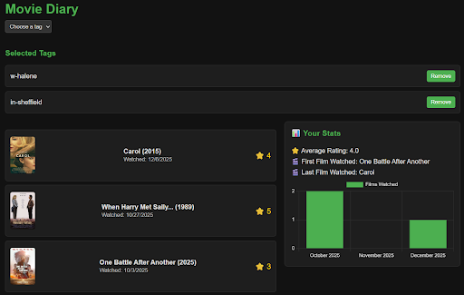
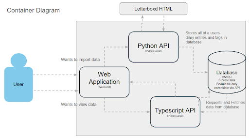
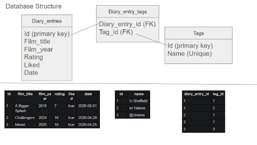
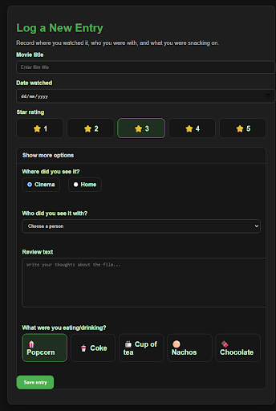

Just a quick vibe coded app as a proof of concept for a feature I wish was in Letterboxd

I had started tagging all of my movie diary entries on Letterboxd with:
Where I saw the movie
Whether I saw the movie in the cinema or not
Who I saw the movie with

However, even though Letterboxd allowed me to tag all of my entries with this information there’s very little ability to actually interact with the data.
I wanted to see all of the stats for different movie watching experiences! I wanted to know what my average rating for a film was when I saw it with my friend who always talks. Does going to the cinema increase my average rating? Does eating a snack at home increase the average rating as much as eating popcorn at the cinema? I wanted an easy interface to find all of these answers.

The concept:

This is my current implementation with all of the basic goals completed! I can now easily see my average rating for a film I watched in Sheffield and then furthermore I can see how much I like films I see in Sheffield with my partner vs when I see them by myself.

First I set about getting all of the data I wanted. This required a python script which scraped all of the data from my Letterboxd profile (all of the information is public!). The Python API then goes on to store all of this data gathered in a MySQL database using the following structure:

I decided to use a junction table making the database easy to maintain and very easily scalable.

Once all of the data is stored in the database I am using a typescript API to access the database. Essentially hosting the requested data on a “tags” API and then when this is requested using a SQL query to find the data I’m interested in:

Next Steps:

There are lots of different directions I want to take this project into. Starting with completely cutting out using Letterboxd. Once I’ve started adding the interface to log movies on my own website I won’t rely on Letterboxd and this will mean I can create a much more user friendly interface for adding these tags:

